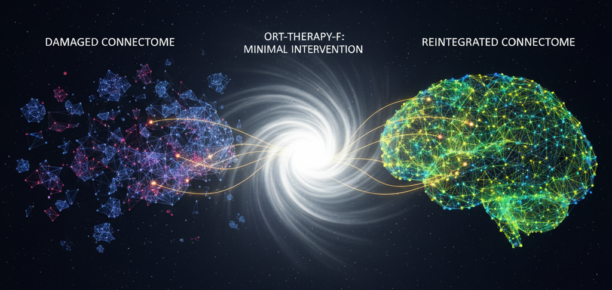

# Minimal Reconnection for Brain Resilience: A Strategic Reconnection Framework (ORT-THERAPY-F) for Damaged Connectomes

[](https://orcid.org/0009-0008-1822-3452)
[](https://orcid.org/0009-0008-1822-3452)
[](mailto:joseignacio.peinador@gmail.com)
[](https://opensource.org/licenses/MIT)
[](https://creativecommons.org/licenses/by-nc/4.0/)
[](https://www.python.org/downloads/)
[](https://doi.org/10.5281/zenodo.17426902)

---


*Conceptual illustration showing "Giant Component Absorption" (GCA). The minimal intervention of ORT-THERAPY-F reconnects the damaged and fragmented connectome (left) to restore its topological integrity (right).*

---

This repository contains the code, data, and experiments for the research paper "**Minimal Reconnection for Brain Resilience: A Strategic Reconnection Framework (ORT-THERAPY-F) for Damaged Connectomes**".

The project models the progressive fragmentation in neurodegenerative diseases (like Alzheimer's) as a **targeted attack that prioritizes the vulnerability of 'hubs' (high-connectivity nodes)**.

We propose ORT-THERAPY-F, a computational framework that validates a strategic reconnection heuristic called **'Giant Component Absorption' (GCA)**. We rigorously compare our heuristic (GCA) against two standard link prediction methods: **Preferential Attachment (PA)** and **Common Neighbors (CN)**.

The results demonstrate that, after severe damage fragments the network into **994 components**, ORT-THERAPY-F **completely restores global connectivity** (reducing 993 components). In stark contrast, the baseline strategies (PA and CN) **fail completely (0 components reduced)**, proving ineffective for this reconnection task. Furthermore, ORT-THERAPY-F achieves this restoration using an optimal connection budget (**36.5% fewer connections** than the baselines) and by being computationally faster.

## 🎯 Main Contributions
* 🧠 **Realistic Damage Model:** Simulates neurodegeneration (Alzheimer's) as a **Targeted Hub Attack** (vulnerability of high-connectivity links), rather than random failure.
* 💯 **Deterministic Reliability:** Our method (GCA) achieved a **100%** reconnection success rate (993 out of 993 fragments repaired). Standard baselines (PA and CN) **failed completely (0% success)**.
* 💡 **Resource Optimality:** We achieved perfect repair using **36.5% fewer connections** than the baseline strategies, which were given a larger budget and still failed.
* 🔬 **Problem Distinction:** We empirically demonstrate that *densification* strategies (PA, CN) are not *reconnection* strategies (GCA), and they fail at the task of restoring global structural integrity.

## 🔬 Interactive and Reproducible Experiment
This repository is designed for open science and full reproducibility. You can run the paper's complete pipeline (loading the connectome, simulating the hub attack, and comparing the therapies) in the following Google Colab notebook.

**Complete Validation Pipeline**
Run the large-scale experiment to validate how ORT-THERAPY-F (GCA) repairs the damaged connectome and why the baselines (PA and CN) fail.
[](https://colab.research.google.com/drive/1dI0tUlcEi-J2Y8QekgNhINdq9smNhXz_) 

## 📂 Repository Structure
* `ORT_THERAPY_F.ipynb`: The interactive Colab notebook with the paper's core experiment.
* `bn-human-BNU-1_0025890_session_1.edges`: The required human connectome dataset (must be downloaded from [Network Data Repository](https://networkrepository.com/bn-human-BNU-1-0025890-session-1.php)).
* `/data`: Contains the `.csv` files with the detailed results generated by the notebook.
* `/figures`: Contains the generated figures for the paper (like the conceptual image above).
* `LICENSE`: The project's MIT License.
* `README.md`: This file.

## 🔬 Independent and Open Science
This work was conducted completely independently, without institutional or corporate funding, demonstrating that cutting-edge research can also emerge from open and accessible environments. This project is the practical application and empirical validation of the principles explored in the [Topological Reinforcement Operator project](https://github.com/NachoPeinador/Topological-Reinforcement-Operator).

[](https://github.com/sponsors/NachoPeinador)

## 🚀 Support and Share this Research
As an independent researcher, the visibility and impact of this work largely depend on community support. If you found this research useful or interesting, here are a few specific ways to help:

* **⭐️ Star on GitHub:** It's the quickest and most direct way to show your support and help others discover this project.
* **🔄 Share on Social Media:** Post a link to the paper's preprint or this repository on Twitter (X), LinkedIn, or your preferred academic network.
* **✍️ Cite the Work:** If this methodology inspires your own research, citation is the most valuable form of recognition in science.
* **💬 Start a Discussion:** Have ideas, questions, or constructive criticism? Open an "Issue" here in the repository.

**Thank you for your support in making independent science visible!**

## ✍️ Citation
If you use this work, please cite it:

**BibTeX Format**
```bibtex
Peinador Sala, J. I. (2025). Minimal Reconnection for Brain Resilience: A Strategic Reconnection Framework (ORT-THERAPY-F) for Damaged Connectomes. Zenodo. https://doi.org/10.5281/zenodo.17426902
